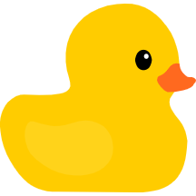

# duckling
JS cursor followe for websites

---

## How to use

#### Install the depencencies

```bash
  yarn add duckling
```

or 

```bash
  npm install --save duckling
```

#### Add to your project

Import in your project
```javascript
import {init, getProps, px} from 'duckling';
```

Initialize
```javascript
const {loadInteractionListeners} = init();
```

Generate the interactions
```javascript
loadInteractionListeners({
  '.nav-item': (elem) => {
    const coordinates = elem.getBoundingClientRect();
    const props = getProps();
    return {
      props: {
        pointerSize: px(parseInt(props.pointerSize) / 2),
        pointerX: px(coordinates.left + coordinates.width / 2),
        pointerY: px(coordinates.top + coordinates.height + 10),
      },
      track: false,
    };
  },
});
```